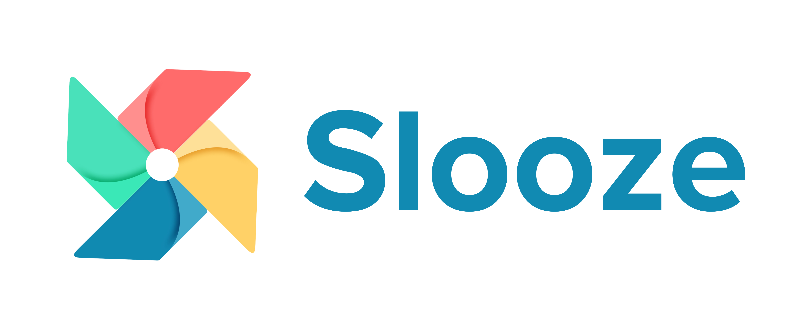

# 🚀 Slooze Frontend Challenge — Commodities Management System

A modern **role-based commodities management system** built with **Next.js, TypeScript, Tailwind CSS, and Zustand**.

---

## ✨ Features Implemented

### 🔐 Authentication & Access
- Mock login system using predefined users
- Role-based authentication (**Manager / Store Keeper**)
- Zustand-powered global auth state

---

### 📊 Dashboard (Manager Only)
- Manager-only protected route
- Displays:
  - Total products
  - Active products
  - Total stock
  - Inventory value
- Recent products preview

---

### 📦 Product Management
- View all products (Manager + Store Keeper)
- Add product (Manager only)
- Edit product (Manager only)
- Data persisted using **localStorage**

---

### 🎨 UI Enhancements
- Light/Dark mode using `next-themes`
- Responsive UI with Tailwind CSS
- Clean card-based product layout

---

### 🔒 Role-Based Access Control (RBAC)
- Route protection (dashboard restricted)
- UI restriction:
  - Store Keeper → View only
  - Manager → Full access
- Dynamic navbar based on role

---

